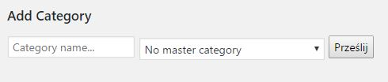

# LinkClick for WordPress

## Adding category

Go to `Settings -> LinkClick -> Add Category Section`   


## Defining access filter

```php
add_filter(
    'linkclick_access',
    __NAMESPACE__.'\linkclick_access_filter',
    10,
    3
);
function linkclick_access_filter($state,$post_id,$lock_id){
    // In most cases you don't want to preceed if permission already denied by another filter
    if( $state !== true ) return $state;
    // Check lock type
    if( $lock_id == 1 ){
        if( /*some rule that checks permission*/){
            return true; // access granted
        }else{
            return 'reason of denial'; // access denied
        }
    }
    // By default you should return the initial state
    return $state;
}
```

## Modifying content of forbidden posts

```php
add_action(
    'linkclick_permission_denied',
    __NAMESPACE__.'\linkclick_permission_denied_action',
    10,
    2
);
function linkclick_permission_denied_action(
    $post,                      // Post object
    $linkclick_access_result    // Always !== true
){
    if( in_the_loop() ){ // Just a sensible precaution
        // Usually you want to act differenlty based on page type
        if( is_singular() ){
            if ( $linkclick_access_result === 'reason of denial' ){
                $post->post_content = '
                <p>This page is only available for logged in users.</p>
                ';
            }
        }else{
            $post->post_content = $post->post_excerpt;
        }
    }
}
```

## Redefining permalinks for permission denial

This filter is applied only if `linkclick_access` filter returned value is `!== true`.

```php
add_filter(
    'linkclick_permission_denied_permalink',
    __NAMESPACE__.'\linkclick_permission_denied_permalink_filter',
    10,
    3
);
function linkclick_permission_denied_permalink_filter(
    $url,                       // Original permalink
    $post,                      // Post object
    $linkclick_access_result    // Always !== true
){
    // In general
    if( $linkclick_access_result === 'reason of denial' ){
        return 'http://example.com';
    }
    // Example: login is required
    if( $linkclick_access_result === 'login_required' ){
        return wp_login_url( $url );
    }
    // By default the original url should be returned
    return $url;
}
```

## Access granted by the code

```php
add_action(
    'linkclick_code_validation',
    __NAMESPACE__.'\linkclick_code_validation_action',
    10,
    2
);
function linkclick_code_validation_action(
    $code_name,     // String - name/type of the code 
    $the_code       // String - code given by the user
){
    if( $code_name === 'my_app_serial_number' ){
        if( serial_number_validation( $the_code ) ){
            update_metadata(
                'user',
                get_current_user_id(),
                'my_app_serial_number',
                true
            );
        }
    }
}
```

## Protecting uploads
``` htaccess
RewriteRule ^wp-content/uploads/.*?$ /index.php [L]
```
